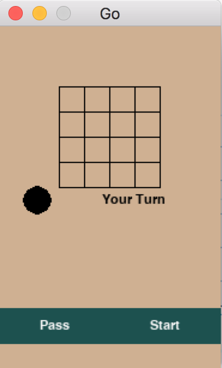
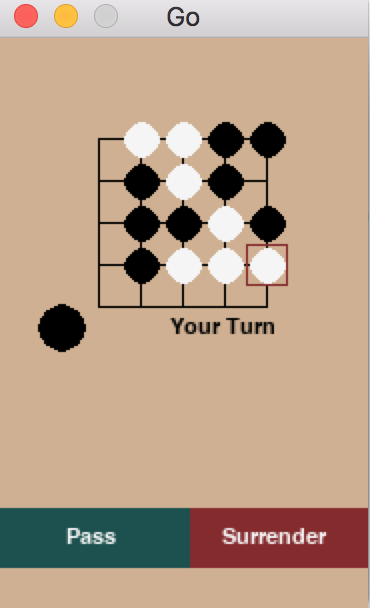

# AlphaGo Zero Clone in Tensorflow (In Progress)
An open-sourced version of the AlphaGo Zero Algorithms in Python and Tensorflow. The original AlphaGo Zero by DeepMind was trained with 64 GPU workers and 19 CPU parameter servers. Due to our computation resource constraints, we reduced the go board size to 5x5. This can be modified with the board_dimension parameter, for those interested who have more computational resources. We stick to all the Go rules, except for Komi, which would give white player an unfair advantage for our smaller (5x5) go board. <br>
<br>
The original AlphaGo Zero paper can be found [here](https://www.nature.com/articles/nature24270.pdf) Python 3 is required to run the code. We used the Tic Tac Toe game to test our MCTS algorithms and "Counting Stones" to test our residual network.

# Components
Residual Network <br />
Self Play <br />
Monte Carlo Tree Search Simulations<br />
GUI implemented in PyGame <br />

## Step 1. Clone the repository, cd into the folder from terminal.
## Step 2. Install all packages required locally. Make sure you have pip installed.
```
pip install -e .
```
## Step 3. To play with an AI Go player that was already trained.
```
python gui/human_machine_gui.py
``` 
A pop up GUI is going to show up. It will look like this. Click start to start playing.
You will be player black who moves first. Click an intersection on the board to place a move. <br>
<br>
 | 

## Step 4. (Optional) If you want to train your own AI go player, this may take a few hours.
```
python gui/alphago_zero.py
```
The models will be stored in the models folder in your local directory. A new model will be stored after each 10 batches of training. To play against your trained classifier, modify the init function of file gui/human_machine_gui.py.
```python
self.alphpago0 = AlphaGoZero(model_path="../models/batch_370", restored=True)
```
Currently, this line sets the AlphaGo model to the local model after 370 batches of training. Change the model path to your desired model trained earlier in you local models/ folder. Then repeat step 3.
## Step 5. (Optional) The project also supports human-human playing mode.
```
python gui/go_gui.py
```