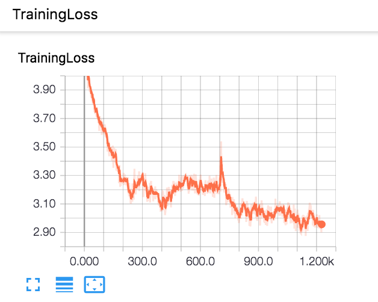

# AlphaGo Zero Clone in Tensorflow
An open-sourced version of the AlphaGo Zero algorithms in Python and Tensorflow. The original AlphaGo Zero by DeepMind was trained with 64 GPU workers and 19 CPU parameter servers. Due to our computing resource constraints, we reduced the go board size to 5x5. This can be modified with the board_dimension parameter, for those interested who have more computing resources. We stick to all the Go rules, except for Komi, which would have given white player an unfair advantage for our smaller go board. <br>
<br>
The original AlphaGo Zero paper can be found [here](https://www.nature.com/articles/nature24270.pdf) Python 3 is required to run the code. We used the Tic Tac Toe game to test our MCTS algorithms and "Counting Stones" to test our residual network. A more detailed explanation on AlphaGo Zero and the clone can be found on [my blog post](https://www.summeryue.me/blog/2018/alpphago-zero-explained/).

## AlphaGo Zero Clone Evaluation
For our simple AlphaGo Zero agent, we trained it on my local MacBook Pro. We used 300 MCTS simluations for each move during self-play, and we had 2000 self-play games. We termincated the training process after 30 hours, although the loss is still going down, which means the clone is still in the process of improving itself.
 

We evaluted the final AlphaGo agent by having it play 20 games against a simple MCTS only agent (with a uniform prior). Then we used the raw neural net without MCTS to play against random play for 100 games. The results are summarized in the table.

| AlphaGo Zero Simulation Number| MCTS Simluation Number| Games Won By AlphaGo Zero  | Games Won By MCTS | Games Tied |
| ------------- |:-------------:| -----:|-----:|-----:|
| 300   | 300 | 12 | 3 | 5 |
| 300   | 500 | 12 | 4 | 4 |
| 300   | 1000 | 11 | 2 | 7 |
| 300   | 1500 | 9 | 7 | 4 |
| 300   | 2000 | 9 | 6 | 5 |
| 300   | 5000 | 14 | 2 | 4 |

| Games Won By Raw Neural Net  | Games Won By Random Play | Games Tied |
| ------------- |:-------------:| -----:|
| 60   | 25 | 15 |

## Instructions
<ul>
    <li>Residual Network</li>
    <li>Self Play and Monte Carlo Tree Search Simulations</li>
    <li>GUI implemented in PyGame</li>
</ul>

### Step 1. Clone the repository, cd into the folder from terminal.
### Step 2. Install all packages required locally. Make sure you have pip installed.
```
pip install -e .
```
  
### Step 3. To play with an AI Go player that was already trained.
```
cd gui
python human_machine_gui.py
``` 
A pop up GUI is going to show up. It will look like this. Click start to start playing.
You will be player black who moves first. Click an intersection on the board to place a move. <br>
<br>

### Step 4. (Optional) If you want to train your own AI go player, this may take a few hours.
```
cd gui
python alphago_zero.py
```
The models will be stored in the models folder in your local directory. A new model will be stored after each 10 batches of training. To play against your trained classifier, modify the init function of file gui/human_machine_gui.py.
```python
self.alphpago0 = AlphaGoZero(model_path="../models/batch_1920", restored=True)
```
Currently, this line sets the AlphaGo model to the local model after 1920 batches of training. Change the model path to your desired model trained earlier in you local models/ folder. Then repeat step 3.
### Step 5. (Optional) The project also supports human-human playing mode.
```
cd gui
python go_gui.py
```

 ## Authors
 * [**Summer Yue**](https://github.com/yutingyue514)
 * [**Lawrence Chan**](https://github.com/chanlaw)

 ### Helpful Comments and Discussions From
 * [**Ben Greenberg**](https://github.com/anchorwatt)
 * [**Troy Wang**](https://github.com/troytianzhengwang)
